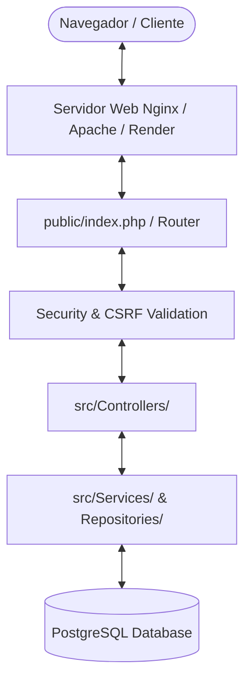

# 🛠️ Manual Técnico de Arquitectura y Sistema - Truper Platform

Bienvenido al **Manual Técnico** de la plataforma web **Truper Platform**. Este documento está diseñado para el equipo de TI, administradores de sistemas y desarrolladores encargados del despliegue, mantenimiento y administración de la infraestructura del proyecto.

---

## 📐 1. Arquitectura General del Sistema

El sistema está desarrollado bajo un patrón arquitectónico **MVC (Modelo-Vista-Controlador) modular y ligero** sobre lenguaje **PHP 8.x** y base de datos **PostgreSQL**. La aplicación prioriza un alto rendimiento, seguridad avanzada y cero dependencias de frameworks pesados para garantizar tiempos de respuesta ultra rápidos.



### 🔒 Capa de Seguridad Integrada
* **Autenticación Flexible**: Soporte para credenciales por Nombre de Usuario (`Admin`, `Personal`) o Correo Electrónico con hash de contraseñas mediante `PASSWORD_BCRYPT` (cost 12).
* **Protección CSRF**: Tokens criptográficos únicos por sesión validados en cada petición de escritura (`POST`, `PUT`, `DELETE`).
* **Rate Limiting por IP y Token**: Protección contra ataques de fuerza bruta en los endpoints de autenticación (`RateLimiter.php`).
* **Cabeceras HTTP de Seguridad**: Configuración activa de `Content-Security-Policy`, `X-Content-Type-Options: nosniff`, `X-Frame-Options: SAMEORIGIN` y `Strict-Transport-Security`.
* **Caché de Servidor Integrada**: Caché de dos niveles (Memoria RAM + Sistema de archivos en `cache/`) para reducir la carga en la base de datos.

---

## 📂 2. Estructura de Directorios y Componentes

```text
proyecto_Truper/
├── config/                  # Configuración global del sistema
│   ├── config.php           # Variables globales, manejo de sesiones y funciones helper
│   ├── database.php         # Conexión PDO con reintentos a PostgreSQL
│   ├── security.php         # Clases de validación de seguridad e IP
│   └── image_cache.php      # Sistema de indexación de imágenes en caché
├── db/                      # Scripts de base de datos
│   ├── database.sql         # Esquema de base de datos limpio para instalación
│   ├── RESET_EMPTY_DATABASE.sql # Script de desinfección total de datos de prueba
│   └── CLEAN_TEST_DATA.sql  # Script de limpieza conservando productos
├── public/                  # Raíz pública del servidor web (DocumentRoot)
│   ├── index.php            # Catálogo principal público
│   ├── admin_login.php      # Formulario de acceso administrativo
│   ├── dashboard.php        # Panel de control de KPIs e indicadores
│   ├── admin_supply.php     # Módulo de abastecimiento e inventario
│   ├── cashier.php          # Módulo de punto de venta y caja
│   ├── tickets.php          # Gestión e impresión de comprobantes
│   ├── css/                 # Hojas de estilo CSS vainilla
│   ├── js/                  # Lógica de cliente JavaScript
│   └── images/              # Catálogo de imágenes de productos
├── src/                     # Código fuente del núcleo backend
│   ├── controllers/         # Controladores de negocio (Auth, Products, Orders, etc.)
│   ├── Repositories/        # Capa de acceso a datos de base de datos
│   ├── Services/            # Servicios de lógica de negocio y notificaciones
│   └── utils/               # Loggers y herramientas auxiliares (AppLogger)
├── .env.example             # Plantilla de variables de entorno para producción
└── Dockerfile               # Configuración para despliegue en contenedores Docker
```

---

## 💻 3. Requisitos del Servidor y Entorno

### Requisitos Mínimos del Servidor Web:
* **Lenguaje**: PHP 8.1 o superior.
* **Extensiones PHP Requeridas**: `pdo`, `pdo_pgsql`, `pg_trgm`, `json`, `session`, `mbstring`, `openssl`, `brotli` o `gd`.
* **Motor de Base de Datos**: PostgreSQL 13 o superior.
* **Servidor Web**: Apache (con `mod_rewrite` activado) o Nginx o plataforma PaaS (Render, Heroku, AWS Elastic Beanstalk).

### Variables de Entorno (`.env`):
Copiar el archivo [.env.example](file:///c:/Users/ksgom/proyecto_Truper/.env.example) a `.env` en la raíz y configurar:

```ini
DB_HOST=localhost
DB_PORT=5432
DB_NAME=truper_platform
DB_USER=truper_admin
DB_PASSWORD=TuPasswordSeguro123!
APP_URL=http://localhost:8000
COMPANY_WHATSAPP_PHONE=3312482297
```

---

## 🚀 4. Guía de Instalación y Puesta en Marcha

1. **Clonar/Copiar el Proyecto**: Colocar los archivos en la ruta asignada del servidor.
2. **Configurar el DocumentRoot**: Apuntar la raíz pública del servidor web al directorio `/public`.
3. **Inicializar la Base de Datos**:
   * Crear la base de datos en PostgreSQL: `CREATE DATABASE truper_platform;`
   * Importar la estructura desde [database.sql](file:///c:/Users/ksgom/proyecto_Truper/database.sql):
     ```bash
     psql -U truper_admin -d truper_platform -f db/database.sql
     ```
4. **Permisos de Escritura**: Asegurar permisos de lectura y escritura en los directorios:
   * `cache/`
   * `logs/`
   * `public/images/products/gallery/`

---

## ⚙️ 5. Mantenimiento y Respaldo

* **Respaldo de Base de Datos**:
  ```bash
  pg_dump -U truper_admin -d truper_platform > backup_truper_$(date +%Y%m%d).sql
  ```
* **Limpieza de Datos de Prueba**: En caso de requerir un reinicio completo manteniendo la estructura de la base de datos, ejecutar en PostgreSQL el script [RESET_EMPTY_DATABASE.sql](file:///c:/Users/ksgom/proyecto_Truper/db/RESET_EMPTY_DATABASE.sql).
* **Caché del Sistema**: Para forzar la regeneración de la caché de imágenes y productos, eliminar el contenido dentro de `cache/`.
